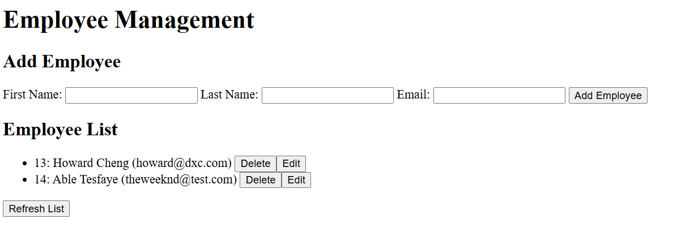
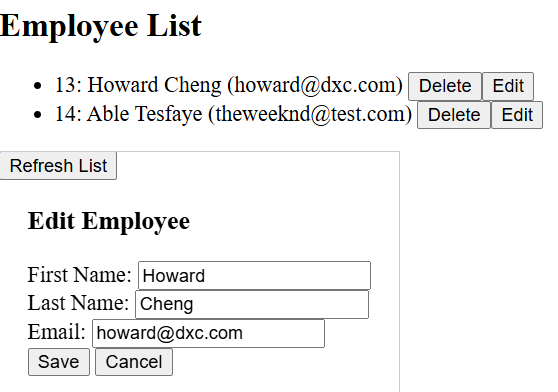

# Employee Manager

A Java **CRUD** (Create, Read, Update, Delete) practice application that demonstrates basic employee management
functionality.

- *Java Spring Boot Backend*: Implements RESTful CRUD operations for employee records.
- *HTML Interface*: Simple web-based user interface for add, edit, read, delete employee's data.
- *SQLite Database*: Uses SQLite as the database to provide better portability, integrated via Spring Data JPA.

## Prerequisites

To get started, ensure you have the following software installed on your system:

- **Java Development Kit (JDK) 8 or higher**
    - Download and install JDK version from
      Oracle's [official website](https://www.oracle.com/java/technologies/javase/javase-jdk8-downloads.html).
- **Git**
    - Download and install Git from its [official website](https://git-scm.com/downloads).
- **Maven**
    - Download and install Maven from the [Apache Maven's website](https://maven.apache.org/download.cgi).

## Appearance

